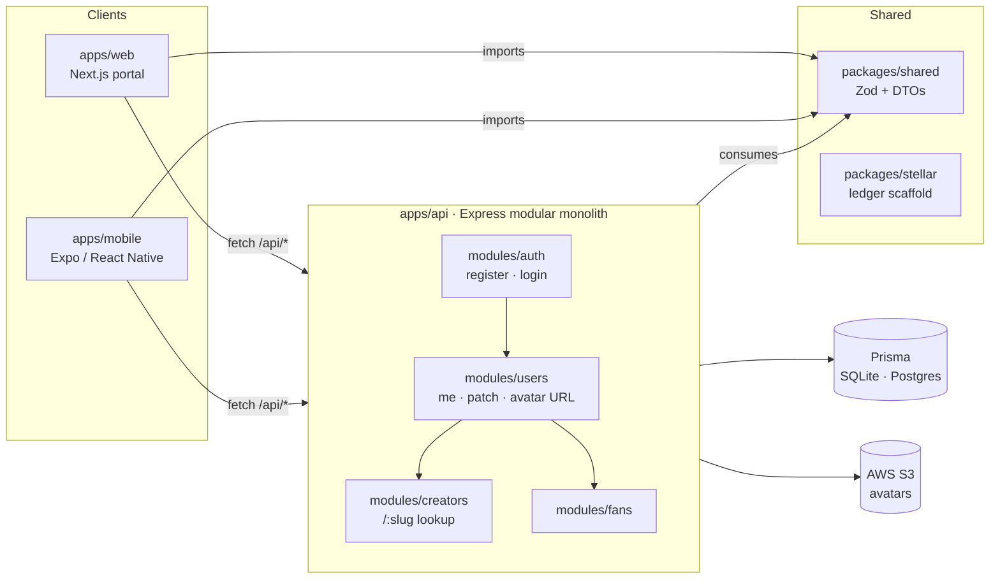

<div align="center">

# Universal Healthcare Data Network

**A secure, contract-first foundation for interoperable healthcare data — built as a TypeScript monorepo with a shared validation core, modular Express API, Next.js portal, Expo mobile client, and a ledger-ready integration scaffold.**

[](https://github.com/ask4moreish/Universal-Healthcare/actions/workflows/api.yml)
[](https://github.com/ask4moreish/Universal-Healthcare/actions/workflows/web.yml)
[](https://github.com/ask4moreish/Universal-Healthcare/actions/workflows/mobile.yml)
[](https://github.com/ask4moreish/Universal-Healthcare/actions/workflows/shared.yml)
[](https://github.com/ask4moreish/Universal-Healthcare/actions/workflows/stellar.yml)
[](https://github.com/ask4moreish/Universal-Healthcare/releases)
[](LICENSE)
[](https://nodejs.org)
[](https://pnpm.io)
[](https://www.typescriptlang.org)
[](https://turbo.build)
[](docs/contributing.md)

[Overview](#overview) · [Features](#features) · [Architecture](#architecture) · [Getting Started](#getting-started) · [Deployment](#deployment) · [Docs](docs/) · [Contributing](docs/contributing.md)

</div>

---

## Overview

**Universal Healthcare Data Network (UHDN)** is an open-source, full-stack foundation for healthcare data interoperability. The codebase is organised so that every layer — API, web, mobile, and shared contracts — evolves against a **single source of truth** defined in TypeScript and Zod.

The goal is to make it easy to spin up new healthcare workflows (provider directories, patient profiles, payer integrations, longitudinal records, consent dashboards) without re-litigating auth, validation, or data shapes between teams.

> UHDN is intentionally a **prototype / foundation**: it makes the right architectural choices, ships the boring-but-essential primitives (auth, profile management, presigned uploads, slug generation, structured errors, structured logging), and gives the runtime surfaces a clean place to grow into.

---

## Features

### Authentication & Identity

- Email + password registration and login with bcrypt hashing
- JWT-based bearer auth with a `requireAuth` middleware
- Persistent client sessions on web (`AuthProvider` + `localStorage`)
- Centralised, typed error model (`AppError` with `statusCode` + machine-readable `code`)

### Profile Domain

- **User** accounts owned by an `email`
- **CreatorProfile** with public `/api/creators/:slug` lookup (display name, bio, avatar, genre, location, verification flag)
- **FanProfile** with genre preferences for tailored experiences
- `PATCH /api/users/me` for self-service profile updates
- Presigned **S3** avatar upload URLs (5 minute TTL) issued from `POST /api/users/me/avatar-upload-url`

### Cross-Platform Surfaces

- **API** – Express modular monolith with one router per domain (`auth`, `users`, `creators`, `…fans`)
- **Web** – Next.js (App Router) portal with login, register, public creator pages, profile editing
- **Mobile** – Expo / React Native shell with a `CreatorProfileScreen`, `ProfileImagePicker` component, and a reusable `useImagePicker` hook

### Shared Contracts

- Zod schemas (`loginSchema`, `registerSchema`, `updateMeSchema`) reused on **both** sides of the wire (server validation = client validation)
- Typed DTOs (`AuthResponse`, `MeResponse`, `CreatorProfileResponse`, `FanProfileResponse`)
- Path-aliased workspace package (`@universal-healthcare/shared`) consumed directly from TypeScript source — no build step

### Developer Experience

- pnpm + Turborepo workspace with per-package GitHub Actions
- Vitest + Supertest on the API, Vitest + Testing Library on web, Jest + jest-expo on mobile
- ESLint flat config, Prettier, TypeScript `strict` mode enforced everywhere
- JSON-structured logger, validated env loader with sensible defaults

### Observability & Hardening

- **Helmet** security headers on every response
- **CORS** allowlist driven by `CORS_ORIGINS` (env-driven; empty list = allow all in dev only)
- **Per-IP rate limiting** on all `/api/*` routes (`RATE_LIMIT_WINDOW_MS` / `RATE_LIMIT_MAX`, no-op in test env)
- **Request ID** (`X-Request-Id`): trust upstream or generate a UUID, attached to logs and response header
- **Structured access log** with method, path, status, duration, userId, requestId
- **Prometheus metrics** at `GET /metrics` — request count + duration histogram + in-flight gauge
- **Liveness / readiness** split: `/livez` (process), `/readyz` (DB ping with 2s timeout)
- **Graceful shutdown** on `SIGTERM` / `SIGINT` — drain connections, disconnect Prisma, force-exit after 25s
- **Compression** (gzip) for all responses ≥ 1KB

### Ledger-Ready Scaffold

- A separate `@universal-healthcare/stellar` package that compiles to placeholder types/interfaces ready for a Stellar payment / data-provenance layer (no blockchain logic yet — kept compile-only so future integrations land in one obvious place)

---

## Architecture

UHDN is a **pnpm + Turborepo** monorepo organised as four runtime apps plus two shared packages.



**Why this shape?**

- The **shared** package is the single source of truth for every request/response shape. When it changes, TypeScript checks and Zod parses catch the mismatch on both sides immediately.
- The **API** is a modular monolith — the routes, services, repositories, validators, types, and tests for each domain live side by side. Add a new module by copying the template (`auth` is the most complete one) and you get lint, typecheck, and test wiring for free.
- The web app **transpiles** `@universal-healthcare/shared` so the workspace package works transparently in Next.js without a build step.
- The mobile app talks to the same API and reuses the same client shape as the web app, so feature parity is enforced by the typechecker.

For deeper architectural notes (how to add a new module, how modules depend on each other, how shared types flow end-to-end), see **[`docs/architecture.md`](docs/architecture.md)**.

---

## Repository Layout

```text
universal-healthcare-data-network/
├── apps/
│   ├── api/        # @universal-healthcare/api     – Express modular monolith
│   ├── web/        # @universal-healthcare/web     – Next.js web portal
│   └── mobile/     # @universal-healthcare/mobile  – Expo / React Native client
│
├── packages/
│   ├── shared/     # @universal-healthcare/shared  – Zod schemas, DTOs, validators
│   └── stellar/    # @universal-healthcare/stellar – ledger integration scaffold
│
├── docs/           # architecture · contributing · environment · testing
├── .github/        # per-package CI workflows
├── tools/          # developer tooling (publish-backlog, etc.)
└── README.md
```

---

## Tech Stack

| Layer   | Stack                                                                                |
| ------- | ------------------------------------------------------------------------------------ |
| Backend | **Express** · **Prisma** (SQLite in dev, swap to Postgres for prod) · **TypeScript** |
| Web     | **Next.js 15** (App Router) · **React 19** · **TypeScript**                          |
| Mobile  | **Expo** · **React Native** · **expo-image-picker**                                  |
| Shared  | **pnpm workspace** · **Turborepo** · **Zod**                                         |
| Auth    | **JWT** (`jsonwebtoken`) · **bcryptjs**                                              |
| Storage | **AWS S3** for avatars via presigned URLs                                            |
| Testing | **Vitest** + **Supertest** (api, web, shared) · **Jest** + **jest-expo** (mobile)    |
| Quality | **TypeScript strict** · **ESLint flat config** · **Prettier**                        |
| CI      | **GitHub Actions** · one workflow per package, scoped via Turbo                      |
| Future  | **Stellar** integration scaffold for data provenance / payment flows                 |

---

## Getting Started

### Prerequisites

- **Node.js ≥ 20** (`.github/workflows/*` pin Node 20)
- **pnpm 10** (the repo root `package.json` declares `pnpm@10.6.5`)
- A POSIX shell (`bash`/`zsh`) — workflows target `ubuntu-latest`

### 1. Install

```bash
pnpm install
```

Turbo caches the result. To force a clean install: `pnpm install --frozen-lockfile=false`.

### 2. Configure environment

Copy the example files for the apps you intend to run:

```bash
cp apps/api/.env.example      apps/api/.env
cp apps/web/.env.example      apps/web/.env.local
cp apps/mobile/.env.example   apps/mobile/.env
```

Fill in your values (see [`docs/environment.md`](docs/environment.md) for the full list).

### 3. Set up the database

The API uses Prisma. Generate the client and push the schema for a local SQLite database:

```bash
pnpm --filter @universal-healthcare/api exec prisma generate
pnpm --filter @universal-healthcare/api exec prisma db push
```

### 4. Run the apps

```bash
# all three at once
pnpm dev

# individually
pnpm dev:api      # http://localhost:4000
pnpm dev:web      # http://localhost:3000
pnpm dev:mobile   # Expo Dev Tools (press i for iOS simulator, a for Android)
```

### 5. Verify

```bash
pnpm check        # lint + typecheck + test across the workspace
```

---

## Application Quickstarts

### `apps/api` – Express backend

```bash
pnpm dev:api      # tsx watch with .env loaded
pnpm --filter @universal-healthcare/api test     # vitest + supertest (sqlite)
pnpm --filter @universal-healthcare/api build   # prisma generate + tsc
```

The current surface is:

| Method | Path                              | Auth   | Description                                    |
| ------ | --------------------------------- | ------ | ---------------------------------------------- |
| GET    | `/health`                         | –      | Simple liveness probe (200)                    |
| GET    | `/livez`                          | –      | Kubernetes-style liveness (process up)         |
| GET    | `/readyz`                         | –      | Readiness probe (pings the DB; 503 on failure) |
| GET    | `/metrics`                        | –      | Prometheus text-format metrics                 |
| POST   | `/api/auth/register`              | –      | Create account, returns user + JWT             |
| POST   | `/api/auth/login`                 | –      | Verify credentials, returns user + JWT         |
| GET    | `/api/users/me`                   | Bearer | Current user + creator / fan profile           |
| PATCH  | `/api/users/me`                   | Bearer | Update own profile (display name, bio, etc.)   |
| POST   | `/api/users/me/avatar-upload-url` | Bearer | Issue a presigned S3 `PUT` URL (5 min TTL)     |
| GET    | `/api/creators/:slug`             | –      | Public creator profile lookup                  |
| GET    | `/api/fans/me`                    | Bearer | Current fan profile                            |
| PUT    | `/api/fans/me`                    | Bearer | Create or replace own fan profile              |
| PATCH  | `/api/fans/me`                    | Bearer | Partial update of own fan profile              |
| PUT    | `/api/fans/me/genre-prefs`        | Bearer | Replace the genre-preferences array            |

All `/api/*` routes are subject to per-IP rate limiting. Configure via `RATE_LIMIT_WINDOW_MS` and `RATE_LIMIT_MAX` (no-op in `NODE_ENV=test`).

### `apps/web` – Next.js portal

```bash
pnpm dev:web
pnpm --filter @universal-healthcare/web test     # vitest + @testing-library/react
pnpm --filter @universal-healthcare/web build   # next build
```

Existing routes:

- `/` – landing + login state
- `/register` – new account
- `/login` – existing account
- `/profile/edit` – update your own profile (creator _or_ fan)
- `/creators/[slug]` – public creator profile page

### `apps/mobile` – Expo / React Native client

```bash
pnpm dev:mobile
pnpm --filter @universal-healthcare/mobile test   # jest + @testing-library/react-native
pnpm --filter @universal-healthcare/mobile ios   # iOS simulator
pnpm --filter @universal-healthcare/mobile android
```

Existing screens / components:

- `src/screens/CreatorProfileScreen.tsx` – fetch + render a creator by slug
- `src/components/ProfileImagePicker.tsx` – tap-to-pick avatar with permission handling
- `src/hooks/useImagePicker.ts` – reusable image picker hook (permission, editing, quality)

> The mobile app currently renders a single Expo placeholder from `App.tsx` while the rest of the surface is brought online. Hooks, services, and screen components are scaffolded so feature work drops in cleanly.

---

## Shared Packages

### `packages/shared`

The contract layer. Source is consumed directly by both `apps/api` and `apps/web` (no build step). Exports:

- **Types** – `AuthUser`, `AuthResponse`, `MeResponse`, `CreatorProfileResponse`, `FanProfileResponse`
- **Validation** – `loginSchema`, `registerSchema`, `updateMeSchema`
- **Utilities** – `profileCompleteness` helper

Change a schema here and every consumer breaks loudly — exactly what you want for shared contracts.

### `packages/stellar`

A **compile-only** scaffold for a future Stellar-based payment or data-provenance layer. It exports placeholder types (`StellarAccountReference`, `StellarNetworkConfig`) and a `StellarPaymentClient` interface — no blockchain, no network calls. When the integration becomes real, this is the one entry point to update.

---

## Environment Variables

Every app keeps a committed `.env.example`. See **[`docs/environment.md`](docs/environment.md)** for the full table. The minimum to run locally:

| App      | Required                     | Optional                                                                                                           |
| -------- | ---------------------------- | ------------------------------------------------------------------------------------------------------------------ |
| `api`    | `DATABASE_URL`, `JWT_SECRET` | `PORT`, `NODE_ENV`, `JWT_EXPIRES_IN`, AWS creds for S3, `CORS_ORIGINS`, `RATE_LIMIT_*`, `TRUST_PROXY`, `LOG_LEVEL` |
| `web`    | –                            | `NEXT_PUBLIC_API_URL` (default `http://localhost:4000`)                                                            |
| `mobile` | –                            | `EXPO_PUBLIC_API_URL` (default `http://localhost:4000`)                                                            |

`apps/api/.env.test` is checked in with safe, test-only values.

---

## Testing & CI

The repo uses **Turbo's task graph**, so tests and lint are scoped to the package you changed and any package that depends on it. Run them manually:

```bash
pnpm test         # all packages
pnpm typecheck    # all packages
pnpm lint         # all packages
pnpm check        # lint + typecheck + test, in that order
```

CI mirrors that. Each package has its own workflow under `.github/workflows/`:

- `api.yml` – `lint · test · build`
- `web.yml` – `lint · test · build`
- `mobile.yml` – `lint · test`
- `shared.yml` – `lint · build`
- `stellar.yml` – `lint · build`
- `docs.yml` – `markdownlint + markdown-link-check`
- `deploy-api.yml` – `docker build + push GHCR + trigger Render deploy`

PRs only need to pass the workflows for the packages they touch (plus their downstream consumers via Turbo). See **[`docs/testing.md`](docs/testing.md)** for runner specifics and coverage notes.

### Verify CI locally before pushing

Run the full CI-equivalent suite with one command — mirrors every step the 7 workflows actually execute (install + per-package turbo + docs lints + `docker build`):

```bash
tools/ci-local.sh                # full suite (api, web, shared, stellar,
                                  # mobile, docs, docker build) — ~3 min
tools/ci-local.sh --quick        # api + web + shared only — ~1 min
tools/ci-local.sh --no-docker    # everything except the docker build
tools/ci-local.sh --no-color     # plain output, for log files
```

The script uses `set -o pipefail` so docker/pnpm exit codes are captured correctly (this was the bug that hid a broken `COPY` line in the Dockerfile for a day), colors each step green/red, prints per-step timings, and exits with the number of failed steps.

---

## Deployment

UHDN is platform-agnostic at the API layer and ships with the build pipelines each framework expects.

### API – Node service

- **Build** – `pnpm --filter @universal-healthcare/api build` (runs `prisma generate` then `tsc`)
- **Start** – `node dist/server.js` (after `build`)
- **Recommended hosts** – Render, Railway, Fly.io, Fly Machines, AWS ECS/Fargate, or any Node 20+ host
- **Production data** – swap SQLite for Postgres by changing the Prisma `datasource` provider and the `DATABASE_URL`
- **Secrets** – inject via the host's env manager; never commit `.env`

### Web – Next.js

- **Build** – `pnpm --filter @universal-healthcare/web build`
- **Recommended host** – Vercel (zero-config for Next.js App Router); Netlify or any Node host also work
- **Env vars** – set `NEXT_PUBLIC_API_URL` to your deployed API origin

### Mobile – Expo

- **Run locally** – `pnpm dev:mobile` (Expo Dev Tools)
- **Build for stores** – configure [EAS Build](https://docs.expo.dev/build/introduction/) and run `eas build --platform ios|android`
- **Env vars** – set `EXPO_PUBLIC_API_URL` in `eas.json` per environment

### Storage – S3

Avatars are uploaded via presigned URLs returned by `POST /api/users/me/avatar-upload-url`. The client `PUT`s the file directly to S3 and persists the returned URL on the profile. For local development, you can stub the S3 URLs in tests or point the bucket at `minio` + a `.env.test` override.

---

## Documentation

| Doc                                                | What's in it                                                                                         |
| -------------------------------------------------- | ---------------------------------------------------------------------------------------------------- |
| **[`docs/architecture.md`](docs/architecture.md)** | Monorepo layout, modular monolith convention, how to add a module, client / shared integration notes |
| **[`docs/contributing.md`](docs/contributing.md)** | Coding standards, dev workflow, contribution expectations                                            |
| **[`docs/testing.md`](docs/testing.md)**           | How to run tests, what each runner covers, what CI runs                                              |
| **[`docs/environment.md`](docs/environment.md)**   | Every env var, every `.env.example`, secrets handling                                                |

---

## Contributing

Contributions are welcome — please read **[`docs/contributing.md`](docs/contributing.md)** before opening a PR. The short version:

1. `pnpm install` and copy the `.env.example` you need.
2. Make scoped, focused changes — extend existing modules / packages rather than introducing new top-level layers.
3. Run `pnpm check` before pushing (`lint` + `typecheck` + `test`).
4. Open a PR against `main`. CI will only run workflows for the packages you touched (plus their downstream consumers).

Don't commit `.env`, secrets, or generated artifacts (`dist/`, `.next/`, `.expo/`, `*.db`).

---

## Roadmap

UHDN ships production-grade auth (register, login, refresh-token rotation, password reset, email verification, role-based activation) and profile management. The next priorities — each pre-scaffolded and building on the existing primitives:

- **Real Stellar integration** – flesh out `packages/stellar` with a Horizon client and reconciliation flows for data provenance.
- **Patient / provider / payer scopes** – additional tables and DTOs sharing the existing module pattern.
- **OAuth / SSO** – Google, Apple, Microsoft Entra for clinician identity.
- **Distributed tracing** – OpenTelemetry across API → Prisma → S3, with W3C `traceparent` propagation.
- **Audit log** – append-only record of every privileged write (login, profile change, role change).
- **Mobile feature parity** – login / profile edit screens in Expo wired to the same API.

Have an idea? See the contributing guide and open an issue or PR.

---

## License

[MIT](LICENSE) · © Universal Healthcare Data Network contributors.

---

## Acknowledgements

UHDN is built on the shoulders of excellent open source:

[Express](https://expressjs.com) · [Next.js](https://nextjs.org) · [React](https://react.dev) · [Expo](https://expo.dev) · [Prisma](https://www.prisma.io) · [Zod](https://zod.dev) · [Turborepo](https://turbo.build) · [pnpm](https://pnpm.io) · [Vitest](https://vitest.dev) · [Jest](https://jestjs.io) · [jsonwebtoken](https://github.com/auth0/node-jsonwebtoken) · [AWS SDK for S3](https://aws.amazon.com/sdk-for-javascript/)

<div align="center">

**Built with care for everyone building the future of healthcare data.**

</div>
